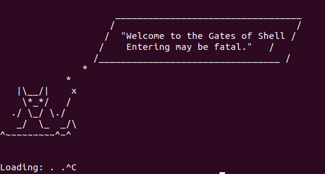

<h1> ** Code_As_Ice **</h1>
<h3> a simple command line interpreter </h3>

Creating a shell in linux using the C programming language.

**CodeAsIce** is a simple command line intepreter that is based on the
Unix shell.
**CodeAsIce** is a work in progress, as a milestone project for Holberton
School of Coding.
**CodeAsIce** does not handle the PATH or Linux built-in commands as of yet.
Upon completion, **CodeAsIce** will operate similar to shell in terms of:
error handling, user input, and execution.

<h2> Requirements </h2>

 * Programmed in emacs
 * Formatted using Betty style and documentation
 * Maximum of 5 functions oer file

<h2> Compilation </h2>

 gcc -Wall -Werror -Wextra -pedantic *.c -o hsh

<h2> Memcheck </h2>

**CodeAsIce** is checked using Valgrind Memory Detector

<h2> Usage </h2>

~/user$ ./hsh
